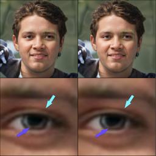
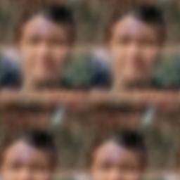

# Modula library experiments
[Modula](https://docs.modula.systems/) is a library focused on exploring metrized deep learning and optimal feature learning in general. It is based on the nice paper [Modular Duality in Deep Learning](https://arxiv.org/abs/2410.21265)

## Setup
```bash
pip install uv
uv venv --python=3.12. # or whichever you like
source .venv/bin/activate
uv sync
```

## INR MLP
To run a simple INR MLP training
```bash
python fit_inr.py -c src/INR/config.yaml
```
| input | with gradient dualization | without gradient dualization |
|-|-|-|
||||

## Develop
Don't forget to set up pre-commit before commiting
```bash
pre-commit install
```
